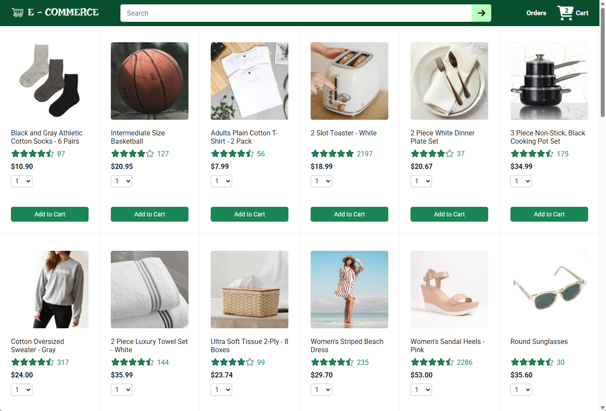
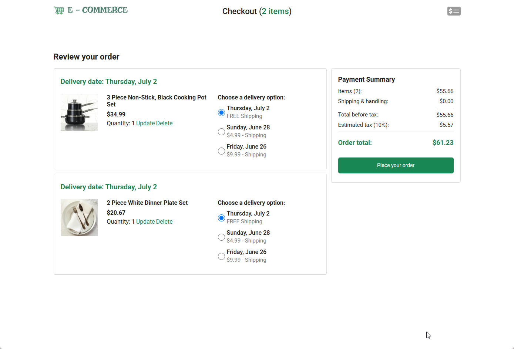
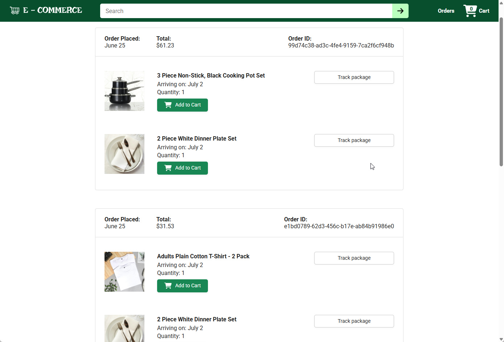
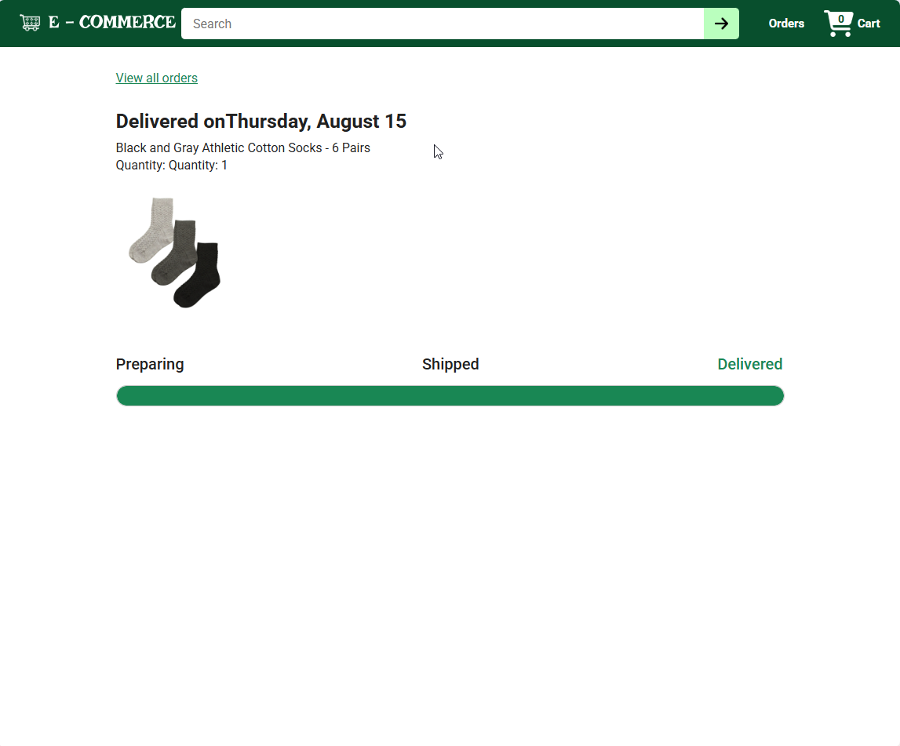

# Green Shop - E-Commerce Website

A full-stack e-commerce application built with **React** and **Express.js**, featuring product browsing, shopping cart management, order placement, and delivery tracking.

## Tech Stack

- **Frontend:** React 19, React Router, Vite, Axios, dayjs
- **Backend:** Node.js, Express.js, SQLite
- **Deployment:** Vercel (frontend), Render/other (backend)

## Features

### 🛍️ Product Catalog
Browse a grid of products with images, ratings, prices, and search functionality.



### 🛒 Shopping Cart & Checkout
Add products to your cart, adjust quantities, select delivery options (with varying shipping speeds and costs), and see a detailed payment summary including item costs, shipping, and taxes.



### 📦 Order Management
View your order history with details on each product, quantity, estimated delivery dates, and total costs.



### 📬 Delivery Tracking
Track the delivery status of individual products within an order with progress indicators showing shipping milestones.



## Getting Started

### Prerequisites
- Node.js 18+
- npm

### Installation

1. **Clone the repository**
   ```bash
   git clone https://github.com/kenneac/Green-Shop.git
   cd Green-Shop
   ```

2. **Install backend dependencies**
   ```bash
   cd backend
   npm install
   ```

3. **Install frontend dependencies**
   ```bash
   cd frontend
   npm install
   ```

### Running Locally

Start the backend server (port 3000):
```bash
cd backend
npm run dev
```

In a separate terminal, start the frontend dev server (port 5173):
```bash
cd frontend
npm run dev
```

The app uses a Vite proxy to forward `/api` requests to the backend. Open `http://localhost:5173` in your browser.

## API Endpoints

| Method | Endpoint                       | Description                |
|--------|--------------------------------|----------------------------|
| GET    | `/api/products`                | List all products          |
| GET    | `/api/delivery-options`        | List delivery options      |
| GET    | `/api/cart-items`              | Get cart items             |
| POST   | `/api/cart-items`              | Add item to cart           |
| PUT    | `/api/cart-items/:productId`   | Update cart item           |
| DELETE | `/api/cart-items/:productId`   | Remove cart item           |
| GET    | `/api/orders`                  | List orders                |
| POST   | `/api/orders`                  | Place order                |
| GET    | `/api/orders/:orderId`         | Get order details          |
| GET    | `/api/payment-summary`         | Get payment summary        |
| POST   | `/api/reset`                   | Reset database             |

## Project Structure

```
├── backend/            # Express.js API server
│   ├── server.js       # Entry point
│   ├── routes/         # API route handlers
│   ├── models/         # Database models
│   └── database.sqlite # SQLite database
├── frontend/           # React SPA
│   ├── src/
│   │   ├── pages/      # Page components (home, checkout, orders, tracking)
│   │   ├── components/ # Shared components (Header, ProductsGrid, etc.)
│   │   └── utils/      # Utility functions
│   └── vite.config.js
└── screenshots/        # App screenshots